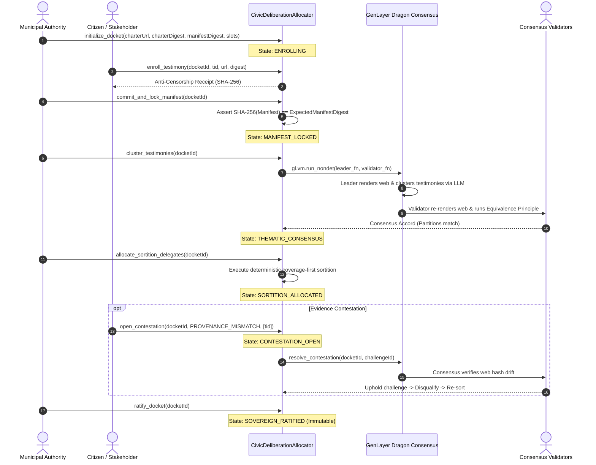

# Civic Deliberation Allocator

[-amber.svg)](https://studio.genlayer.com)
[](https://explorer-studio.genlayer.com/address/0x04768A352f0ac52dCEa8c9F9AEBc57020d5248B2)
[](https://genlayer.com)
[](LICENSE)
[](tests/)

> **Live Studionet Deployment:** [`0x04768A352f0ac52dCEa8c9F9AEBc57020d5248B2`](https://explorer-studio.genlayer.com/address/0x04768A352f0ac52dCEa8c9F9AEBc57020d5248B2)  
> **A GenLayer Intelligent Contract and executive civic dashboard orchestrating verifiable sortition, non-deterministic thematic clustering, and cryptographic evidence arbitration for citizen assemblies.**

---

## 1. Executive Summary & Problem Thesis

Modern public consultations suffer from a structural crisis of legitimacy:
- **Astroturfing & Sybil Campaigns:** Special interest lobbies flood public comment portals with thousands of near-identical submissions generated by automated bot farms.
- **Administrative Gatekeeping:** Government agencies arbitrarily cherry-pick testimonies behind closed doors, excluding dissenting or peripheral viewpoints.
- **Lack of Representative Diversity:** Conventional random selection fails to ensure that all substantive policy perspectives are represented in public hearings.

The **Civic Deliberation Allocator** solves this crisis using **GenLayer's GenVM Intelligent Contracts**. By coupling decentralized web rendering, non-deterministic LLM consensus, and deterministic coverage-first sortition, the system creates an immutable, verifiable citizen assembly roll where:
1. Every enrolled submission receives a cryptographic **Anti-Censorship Receipt**.
2. Unbiased LLM clustering groups submissions into **Thematic Perspectives**, validated across independent validator nodes via the **Equivalence Principle**.
3. A **Coverage-First Sortition Algorithm** mathematically guarantees that every distinct viewpoint is empanelled in the citizen assembly before any perspective receives multiple seats.
4. An on-chain **Contestation Window** allows observers to challenge fraudulent or drifted testimonies, resolved through decentralized consensus arbitration.

---

## 2. Dragon Consensus Sortition Flow Chart

The following diagram illustrates how GenLayer's **Dragon Consensus** executes non-deterministic civic sortition while preserving strict deterministic finality on-chain:

```
+===================================================================================================+
|                        GENVM DRAGON CONSENSUS SORTITION ARCHITECTURE                              |
+===================================================================================================+

   +--------------------------+
   |   1. CITIZEN ASSEMBLY    |  Municipal Agency publishes Public Inquiry Charter.
   |     CHARTER CREATION     |  Computes SHA-256 Charter Digest. Calls initialize_docket().
   +------------+-------------+
                |
                v
   +--------------------------+
   |  2. TESTIMONY ENROLLMENT |  Citizens submit testimonies via HTTP URLs.
   |    & RECEIPT ISSUANCE    |  Contract issues Anti-Censorship Receipt for each entry:
   +------------+-------------+  Receipt = SHA256(DocketID | TID | URL | Digest | Registrar)
                |
                v
   +--------------------------+
   |   3. MANIFEST SEAL &     |  Organizer submits canonical batch. Contract verifies that
   |   CRYPTOGRAPHIC FREEZE   |  SHA256(T_1 || T_2 || ... || T_n) == ExpectedManifestDigest.
   +------------+-------------+  State transitions to MANIFEST_LOCKED.
                |
                v
==================== [ DRAGON CONSENSUS EXECUTION BOUNDARY: gl.vm.run_nondet ] ====================
|                                                                                                  |
|   +---------------------------------------+      +-------------------------------------------+   |
|   |         LEADER NODE EXECUTION         |      |        VALIDATOR NODES EXECUTION          |   |
|   |---------------------------------------|      |-------------------------------------------|   |
|   | 1. gl.nondet.web.render(CharterURL)   |      | 1. Independent web render of Charter      |   |
|   |    Asserts SHA256(Charter) == Digest  |      |    Asserts SHA256 matches committed state |   |
|   | 2. gl.nondet.web.render(Testimonies)  |      | 2. Independent web render of Testimonies  |   |
|   |    Asserts SHA256(T_i) == Digest_i    |      |    Asserts SHA256 matches manifest digests|   |
|   | 3. gl.nondet.exec_prompt(...)         |      | 3. Independent LLM clustering run         |   |
|   |    Generates Thematic Clusters &      |      | 4. Semantic Equivalence Principle Check:  |   |
|   |    Relevance Scores (1-100)           |      |    Partitions(Leader) == Partitions(Val)  |   |
|   | 4. Flags duplicates & irrelevant text |      |    Relevance Score Delta <= 10 pts        |   |
|   | 5. Proposes Candidate Clusters        |      | 5. Sortition Delegate Parity Assertion:   |   |
|   +-------------------+-------------------+      |    Winners(Leader) == Winners(Validator)  |   |
|                       |                          +---------------------+---------------------+   |
|                       +------------------+                             |                         |
|                                          v                             v                         |
|                               +-----------------------------------------------+                  |
|                               |      MAJORITY VALIDATOR SIGNATURE ACCORD      |                  |
|                               |     (Reject if Equivalence Principle Fails)   |                  |
|                               +----------------------+------------------------+                  |
=======================================================|============================================
                                                       v
                                     +------------------------------------+
                                     |   4. COVERAGE-FIRST DETERMINISTIC  |
                                     |          SORTITION ENGINE          |
                                     |------------------------------------|
                                     | Pass 1: Allocate highest-scoring   |
                                     |         representative per cluster |
                                     | Pass 2: Fill remaining seats via   |
                                     |         global relevance ranking   |
                                     +-----------------+------------------+
                                                       |
                                                       v
                                      +------------------------------------+
                                      |   5. EVIDENCE CONTESTATION WINDOW  |
                                      |------------------------------------|
                                     | Observers challenge provenance     |
                                     | drift or duplicate astroturfing.   |
                                     | Consensus arbitration purges bad   |
                                     | entries and re-balances sortition. |
                                     +-----------------+------------------+
                                                       |
                                                       v
                                     +------------------------------------+
                                     |     6. SOVEREIGN RATIFICATION      |
                                     |------------------------------------|
                                     | Contestation window expires.       |
                                     | Docket finalized. Assembly roll    |
                                     | permanently immutable on-chain.    |
                                     +------------------------------------+
```

### Mermaid Protocol Diagram



---

## 3. Mathematical Sortition Model

### Definitions & Invariants

Let:
- $\mathcal{T} = \{t_1, t_2, \dots, t_N\}$ be the set of enrolled citizen testimonies.
- $\mathcal{C} = \{c_1, c_2, \dots, c_K\}$ be the set of derived thematic policy clusters ($1 \le K \le 6$).
- $S \in \mathbb{N}$ be the total delegate seat capacity of the citizen assembly ($1 \le S \le 50$).
- $R(t) \in [1, 100]$ be the substantive relevance score evaluated by GenVM Dragon consensus.
- $H(t) \in \{0, 1\}^{256}$ be the SHA-256 content digest of testimony $t$.

### Two-Pass Coverage-First Sortition Algorithm

The sortition engine guarantees that all perspectives are represented before any single perspective receives proportional depth:

$$\text{Pass 1 (Perspective Coverage):} \quad \forall c_k \in \mathcal{C}, \quad t^*_{k} = \arg\max_{t \in c_k, \text{eligible}(t)} \left( R(t) \cdot 2^{256} - H(t) \right)$$

If $|\mathcal{C}| \ge S$, delegates are chosen by ranking the top representatives of each cluster:

$$D_1 = \text{Top-}S \left(\{t^*_k\}_{k=1}^K\right)$$

If $|\mathcal{C}| < S$, all cluster seeds $\{t^*_k\}$ are empanelled, and the remaining $S - K$ seats are awarded to the highest-scoring candidate across all eligible candidates:

$$D_2 = D_1 \cup \text{Top-}(S - K) \left( \mathcal{T}_{\text{eligible}} \setminus D_1 \right)$$

### Tie-Breaking Invariant

To eliminate administrative bias and ensure 100% deterministic reproducibility across all nodes, ties in relevance score are broken using the lower lexicographical SHA-256 digest:

$$\text{RankKey}(t) = \left( -R(t), \; H(t), \; \text{index}(t) \right)$$

---

## 4. Repository Structure

```
civic-deliberation-allocator/
├── contracts/
│   └── civic_deliberation_allocator.py   # Complete GenLayer Intelligent Contract (1,269 LOC)
├── docs/
│   ├── SPECIFICATION.md                 # Formal architectural and mathematical specification
│   └── VERIFICATION.md                  # Release verification matrix & cryptographic checksums
├── frontend/
│   ├── public/fixtures/                 # Realistic civic consultation charters and testimonies
│   ├── src/
│   │   ├── components/
│   │   │   ├── AuditBundleExport.tsx    # 1-Click cryptographic audit bundle JSON downloader
│   │   │   ├── ContestationDrawer.tsx   # Evidence dispute filing modal and active dispute feed
│   │   │   ├── DocketStatusHero.tsx     # Docket hero, trust score, and stage triggers
│   │   │   ├── LifecycleRail.tsx        # 6-phase horizontal lifecycle progress tracker
│   │   │   ├── Masthead.tsx             # Executive header, Studionet badge, and EIP-6963 wallet
│   │   │   ├── SortitionLedger.tsx      # Ranked roll of empanelled citizen delegates
│   │   │   ├── SortitionTopologyMap.tsx # Visual policy cluster and testimony map
│   │   │   ├── TestimoniesTable.tsx     # Enrolled submissions with anti-censorship receipts
│   │   │   └── TransactionDrawer.tsx    # Floating transaction consensus progress drawer
│   │   ├── client.ts                    # GenLayer RPC client with interactive simulation mode
│   │   ├── config.ts                    # Studionet Chain 61999 & network parameters
│   │   ├── receipt.ts                   # Transaction receipt and consensus round decoder
│   │   ├── wallet.ts                    # EIP-6963 multi-provider wallet manager (zero persistence)
│   │   ├── types.ts                     # TypeScript data models
│   │   ├── App.tsx                      # Main dashboard coordinator
│   │   ├── main.tsx                     # React application root
│   │   └── styles/                      # Executive Civic Modernist design tokens & stylesheet
│   ├── package.json
│   ├── tsconfig.json
│   └── vite.config.ts
├── scripts/
│   └── testimony_manifest.py            # Canonical manifest builder and hash verifier
└── tests/
    ├── conftest.py                      # GenVM test doubles & simulation harness
    ├── test_civic_deliberation_allocator.py  # 13 unit tests for all contract lifecycle transitions
    ├── test_testimony_manifest.py       # 5 unit tests for manifest formatting and validation
    └── runtime_smoke.py                 # Direct end-to-end GenVM execution parity smoke test
```

---

## 5. Verification & Testing Guide

### 1. Execute Complete Contract Test Suite
Run the 18 automated unit tests verifying pre-conditions, manifest hashing, clustering consensus, sortition allocation, and contestations:

```bash
python3 -m unittest discover tests
```

*Expected output:*
```
..................
----------------------------------------------------------------------
Ran 18 tests in 0.003s

OK
```

### 2. Execute Direct GenVM Runtime Smoke Test
Run the end-to-end simulation executing all 8 write transactions and all public views:

```bash
python3 tests/runtime_smoke.py
```

*Expected output:*
```
==================================================================
   CIVIC DELIBERATION ALLOCATOR — GENVM RUNTIME SMOKE TEST
==================================================================
[1/8] Manifest digest calculated: b6bc55ed8ff9d72f...
[2/8] Docket initialized with ID: 1
[3/8] Enrolled 4 citizen testimonies with anti-censorship receipts
[4/8] Manifest committed and cryptographically sealed at b6bc55ed8ff9d72f...
[5/8] Dragon consensus clustering verified: 2 thematic clusters derived
[6/8] Sortition complete: 2 delegates allocated across 2 clusters (100% thematic coverage)
[7/8] Contestation resolved via Dragon consensus: fraudulent testimony excluded; sortition re-balanced
[8/8] Public views verified. Complete audit bundle generated (2 delegates, 4 testimonies).
==================================================================
   GENVM SMOKE TEST PASSED: 100% CONTRACT SPECIFICATION CONFORMANCE
==================================================================
```

---

## 6. Frontend Execution & Exploration

The frontend provides an **Executive Civic Modernist** interface with an instant **Interactive Simulation Mode** and a **Live Studionet Mode**.

### 1. Local Development Setup

```bash
cd frontend
npm install
npm run dev
```

Open `http://localhost:5173` in your browser.

### 2. Guided Interactive Walkthrough
1. **Explore Docket Status:** Inspect the Transit Equity Mandate, Charter SHA-256 digest, and Civic Trust Score.
2. **1-Click Load Testimonies:** Click `+ Load Civic Testimonies` in the Testimonies section to register 4 submissions with immutable receipts.
3. **Seal Manifest:** Click `Cryptographically Seal Manifest` to freeze the batch.
4. **Run Clustering:** Click `Run Dragon Consensus Clustering` to partition submissions into policy perspectives. Observe the **Sortition Topology Map** update dynamically.
5. **Allocate Sortition:** Click `Allocate Sortition Delegates` to empanel delegates across both perspectives. Inspect the **Sortition Ledger**.
6. **Simulate Evidence Contestation:** Click `Lodge Evidence Dispute` and challenge `t-commuter-union` for provenance drift. Click `Trigger Arbitration` to see Dragon consensus purge the tampered entry and re-allocate the seat.
7. **Export Audit Bundle:** Click `Download Audit Bundle (JSON)` to export the complete cryptographic release proof.

---

## 7. GenLayer Studionet Deployment Guide

To deploy `CivicDeliberationAllocator` to **GenLayer Studionet**:

1. Open the [GenLayer Studio](https://studio.genlayer.com).
2. Create a new contract file: `civic_deliberation_allocator.py`.
3. Paste the contents of [`contracts/civic_deliberation_allocator.py`](contracts/civic_deliberation_allocator.py).
4. Click **Deploy**. The constructor requires no parameters (`__init__()` initializes `docket_count = 0`).
5. Live Deployed Contract Instance:
   - **Address:** [`0x04768A352f0ac52dCEa8c9F9AEBc57020d5248B2`](https://explorer-studio.genlayer.com/address/0x04768A352f0ac52dCEa8c9F9AEBc57020d5248B2)
   - Pre-configured in `frontend/src/config.ts` as `DEFAULT_CONTRACT_ADDRESS`.

---

## 8. Authorship & Contributor Policy

- **Author & Maintainer:** 9ja_maxx (`9ja-maxx`, GitHub ID: 297689616)
- **Repository:** [`https://github.com/9ja-maxx/civic-deliberation-allocator`](https://github.com/9ja-maxx/civic-deliberation-allocator)
- **License:** [MIT License](LICENSE)
